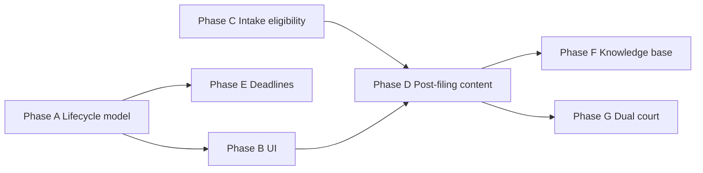

# Plan 21 — NY Divorce Ecosystem Lifecycle (Phase 2)

**Status:** Complete  
**Priority:** P1 (next major milestone after MVP Plans 01–18)  
**Depends on:** Plans 04, 06, 08, 09, 10, 12 (workflow engine, package builder, dashboard, timeline, guidance, AI assistant)  
**Requirements source:**
- `docs/requires/CourtFlowAI_NY_Divorce_Ecosystem_Manual.docx`
- `docs/requires/ProSeNY_Divorce_Workflow.docx`

**Estimated effort:** Large (3–4 weeks, phased)

---

## Executive summary

The two new documents describe the **full matrimonial lifecycle** — from eligibility through post-judgment — not just intake and form generation. CourtFlow already covers **intake → routing → package download → intake-phase roadmap** well. The largest gap is **post-filing case tracking**: filing confirmation, service, answer deadlines, default vs contested branching, discovery/settlement/trial, judgment, and case closed.

This plan extends the **rules engine and dashboard** to match the 10-phase workflow in `ProSeNY_Divorce_Workflow.docx` and the dashboard architecture in the Ecosystem Manual (§21), without letting AI invent stages or deadlines.

---

## Gap analysis (documents vs current system)

| Area | Documents require | Current system | Gap |
|------|-------------------|----------------|-----|
| **Eligibility** | Residency check before filing recommendation | County + workflow routing during intake | No explicit eligibility gate or “not eligible” UX |
| **Intake facts** | Marriage date/location, residency qual, children, custody/support disputes, assets/debts/income, prior cases, DV | Most divorce workflows collect core facts; gaps on marriage location, residency qualification, explicit DV/prior-case flags | Partial — expand `required_fields` in workflow JSON |
| **Case roadmap** | Personalized roadmap after intake (Phase 3) | `Procedural_Roadmap_Presenter` — strong for **intake**; weaker for **post-intake stages** | Extend roadmap seeds per workflow stage |
| **Document generation** | Divorce forms package (Phase 4) | Package builder + Get Documents (Plan 06) | Mostly done — verify commencement packet completeness |
| **Filing** | Instructions + user confirmation (Phases 5) | Procedural guidance briefs; no “I filed” checkpoint | Missing lifecycle events |
| **Service** | Instructions + tracking (Phase 6) | Guidance copy exists; no service date capture | Missing tracking UI + deadlines trigger |
| **Answer period** | Calculate deadline + monitor response (Phase 7) | `Timeline_Service` + deadline catalog (backend); not user-facing | Wire timeline to workspace + dashboard |
| **Branching** | Default (8A) vs Contested (8B) | `default_divorce_nyc` workflow exists; no runtime branch after service | Need lifecycle branch rules |
| **Discovery → Judgment** | Phases 8B–9 | Contested workflow JSON has stages; no user progression | Stage advancement + guidance per stage |
| **Post-judgment** | Certified copies, enforcement/modification (Phase 10) | Mentioned in inventory; not in user lifecycle | New post-judgment stage seeds |
| **Dashboard** | Eligibility → … → Closed (10 milestones) | Dashboard shows case progress **summary**; progress rail is **intake-only** (9 steps ending at Ready to File) | Misaligned lifecycle model |
| **Dual court** | Supreme + Family Court parallel matters | Overlap routing (Plan 03); single-track UI | Parallel matter tracks on dashboard |
| **Knowledge base** | Forms, deadlines, locations, procedures (§23) | Knowledge center (Plan 15) started | Content gap for ecosystem manual topics |
| **AI behavior** | Answer direct question first; procedural Q&A; return to workflow (§20) | Recent proactive guidance work aligns | Tune prompts + procedural interrupt handling |

---

## Core architecture principle (unchanged)

```
User facts + lifecycle events
        ↓
Rules Engine (workflow JSON + lifecycle rules + deadline catalog)
        ↓
Structured outputs: stage, roadmap, forms, deadlines, next step
        ↓
AI explains only — never chooses court, workflow, or stage
```

---

## Proposed phases

### Phase A — Lifecycle data model (foundation)

**Goal:** Persist and expose a deterministic **case lifecycle stage** separate from intake completion.

**Deliverables**

1. `Case_Lifecycle` enum / catalog aligned to documents:
   - `eligibility` → `intake` → `forms_ready` → `filed` → `served` → `awaiting_answer` → (`default_track` | `contested_track`) → `discovery` → `settlement` → `trial` → `judgment` → `post_judgment` → `closed`
2. Store on `case_profile`:
   - `lifecycle_stage`
   - `lifecycle_events[]` (e.g. `{ event: 'served', date: '2026-06-01', source: 'user' }`)
   - `branch` (`default` | `contested` | null)
3. REST: `PATCH /prose/v1/courtflow/sessions/{id}/lifecycle` — user confirms milestones (filed, served, answer received, etc.)
4. Rules: stage transitions computed from events + workflow key (not AI)

**Acceptance**

- [ ] User marks “I filed” → stage advances to `filed`; roadmap refreshes
- [ ] User enters service date → stage `served`; answer deadline computed
- [ ] Spouse did not answer within window → branch suggests `default_divorce_nyc` track (informational, not legal advice)

---

### Phase B — Dashboard & workspace lifecycle UI

**Goal:** Match Ecosystem Manual §21 and ProSeNY recommended dashboard checklist.

**Deliverables**

1. **Dashboard Case Lifecycle widget** (compact horizontal stepper or checklist):
   - Shows milestones with completed / current / upcoming
   - Replaces or supplements current intake-only progress %
2. **Workspace lifecycle panel** (full detail):
   - Current stage, next likely step, key deadline, link to forms for this stage
   - Reuse `Procedural_Roadmap_Presenter` — extend to post-intake mode
3. Align `themes/prose-app/inc/courtflow/steps.php`:
   - Option A: split **Intake rail** (existing 9 steps) + **Case lifecycle rail** (post-filing)
   - Option B (recommended): intake rail collapses after `forms_ready`; lifecycle rail takes over

**Acceptance**

- [ ] Dashboard checklist matches document order through at least `Served` → `Awaiting Answer`
- [ ] Workspace roadmap card updates when lifecycle event recorded
- [ ] Dashboard never shows full discovery/settlement detail lists (summary only, per Option B pattern)

---

### Phase C — Intake & eligibility alignment

**Goal:** Cover Ecosystem Manual §5–6 intake questions and Phase 1–2 of ProSeNY workflow.

**Deliverables**

1. Audit workflow `required_fields` for all 4 divorce workflows; add missing keys:
   - `marriage_location`
   - `residency_qualification` (structured: 1-year / 2-year / other)
   - `custody_dispute`, `support_dispute` (booleans)
   - `domestic_violence_concerns` (boolean — routes to safety workflows, does not block divorce intake)
   - `prior_court_cases` (array)
2. **Eligibility presenter** (deterministic):
   - Before recommending filing, check residency facts against static NY rules catalog
   - Output: `eligible` | `needs_more_info` | `likely_ineligible` with plain-language reason
3. Update `intake-roadmaps/divorce.json` steps to mirror Phase 1–2 document steps

**Acceptance**

- [ ] Intake collects all §5 fields for uncontested + contested divorce
- [ ] User without sufficient residency facts sees eligibility guidance, not filing package
- [ ] DV concern surfaces OP workflow link without AI deciding strategy

---

### Phase D — Post-filing procedural content & branching

**Goal:** Phases 5–10 of ProSeNY workflow — guidance and forms per stage.

**Deliverables**

1. Guidance seed JSON per stage (Supreme Court divorce):
   - `filing`, `service`, `answer`, `default_judgment`, `discovery`, `settlement`, `trial`, `judgment`, `post_judgment`
2. Extend `Procedural_Roadmap_Presenter::build_workflow_roadmap()` to use stage-aware seeds (not only intake roadmap)
3. **Branch resolver** (rules only):
   - After `awaiting_answer`: if `spouse_responded=false` + deadline passed → default track
   - If `spouse_responded=true` or contested facts → contested track
4. Package manifest: stage-tagged forms (commencement vs default judgment vs judgment submission)

**Acceptance**

- [ ] User on default track sees default judgment package forms
- [ ] User on contested track sees discovery/settlement guidance (informational)
- [ ] “What happens next” after service returns service/answer content, not intake questions

---

### Phase E — Deadlines & service tracking

**Goal:** Ecosystem Manual §8–9; ProSeNY Steps 11–13.

**Deliverables**

1. User-facing deadline block (workspace + dashboard alert badge):
   - Answer deadline from service date (static catalog: e.g. 20/30 days — verify against rules)
   - Display plain-language explanation (not legal advice)
2. Lifecycle events trigger `Timeline_Service::recalculate`
3. Optional: “Spouse answered” / “No answer received” buttons

**Acceptance**

- [ ] Service date entry produces visible answer deadline
- [ ] Deadline appears in dashboard summary when within N days
- [ ] AI can explain deadline using navigator content; cannot invent dates

---

### Phase F — Knowledge base & training content sync

**Goal:** Ecosystem Manual §14–19, §23 — searchable procedural reference.

**Deliverables**

1. Convert manual sections to `docs/knowledge-center/` articles (version-controlled):
   - Property, custody, support, maintenance, OP, Family Court matters
2. Tag articles with `workflow`, `stage`, `court` metadata
3. Link knowledge articles from roadmap cards and context panel
4. Add extracted `.txt` copies of the two new docx files to `_extracted/` (docx stays gitignored)

**Acceptance**

- [ ] User can find “service of process” and “answer period” in knowledge center
- [ ] Roadmap “learn more” links resolve to correct article

---

### Phase G — Dual-court & ecosystem completeness

**Goal:** Ecosystem Manual §2, §19 — divorce + parallel Family Court matters.

**Deliverables**

1. **Matter map** on dashboard when `active_divorce` + family court workflow linked:
   - Supreme Court track + Family Court track (side by side)
2. Post-judgment entry points: modification / enforcement as **separate workflows** (already in inventory) linked from closed divorce case
3. County coverage verification: all 5 counties have filing location + e-filing notes in county rules (Plan 13)

**Acceptance**

- [ ] User with divorce + custody sees two tracks, not merged confusion
- [ ] Post-judgment CTA routes to correct workflow JSON, not AI suggestion

---

## Recommended execution order



| Order | Phase | Why first |
|-------|-------|-----------|
| 1 | **A** — Lifecycle model | Everything else needs persisted stage + events |
| 2 | **C** — Intake & eligibility | Low risk; JSON-only; improves routing quality |
| 3 | **B** — Dashboard UI | User-visible value; uses existing roadmap presenter |
| 4 | **E** — Deadlines | High user value; depends on service date from A |
| 5 | **D** — Post-filing content | Largest content effort |
| 6 | **F** — Knowledge base | Parallelizable with D |
| 7 | **G** — Dual court | Polish after single-track lifecycle works |

---

## What we should NOT do in this plan

- AI-generated procedural steps or deadlines
- Automatic NYSCEF docket sync (Plan 19)
- Legal strategy (“you should file for default”)
- Replacing workflow JSON with hardcoded PHP divorce logic
- Full auto-filled PDFs from intake (separate milestone)

---

## Open questions for your review

1. **Lifecycle confirmation model:** Should users manually check off “Filed” / “Served”, or should we only show guidance until document intelligence (Plan 11) can infer from uploads?
2. **Dashboard scope:** Full 10-milestone checklist on dashboard, or keep dashboard compact (current + next stage) and put full checklist in workspace only?
3. **Default vs contested:** Informational branch only, or generate different form packages automatically when user selects “no answer received”?
4. **Eligibility strictness:** Block package download when residency facts are insufficient, or warn and allow download?
5. **Content ownership:** Who approves post-filing procedural copy before it ships (legal review workflow)?
6. **Version control:** OK to commit extracted `.txt` from the two docx files under `docs/requires/_extracted/` while keeping `.docx` gitignored?

---

## Success metrics (Phase 2)

- User can complete intake → download package → record filed/served → see answer deadline → see correct next-stage roadmap
- Dashboard lifecycle checklist reflects real case state
- Zero AI-invented forms, deadlines, or court rules in UAT
- All 4 divorce workflows pass lifecycle UAT through `awaiting_answer` minimum

---

## Files likely touched (summary)

| Layer | Files |
|-------|-------|
| Rules / data | `docs/workflows/divorce/*.json`, `modules/guidance/data/**`, `modules/forms/engine/class-deadline-catalog.php` |
| Backend | New `Case_Lifecycle_Service`, extend `Procedural_Roadmap_Presenter`, REST lifecycle endpoint |
| Frontend | `build/dashboard.js`, `build/courtflow.js`, `courtflow-context-panel.php`, new lifecycle stepper |
| Content | `docs/knowledge-center/**`, `docs/ai/system-prompt.md` |
| Tests | Lifecycle transitions, deadline calc, roadmap stage gating, dashboard payload |

---

## Approval checklist

Mark each before implementation:

- [ ] **Approve** full Plan 21
- [ ] **Revise** — specify which phases to defer
- [ ] **Answer** open questions 1–6 above
