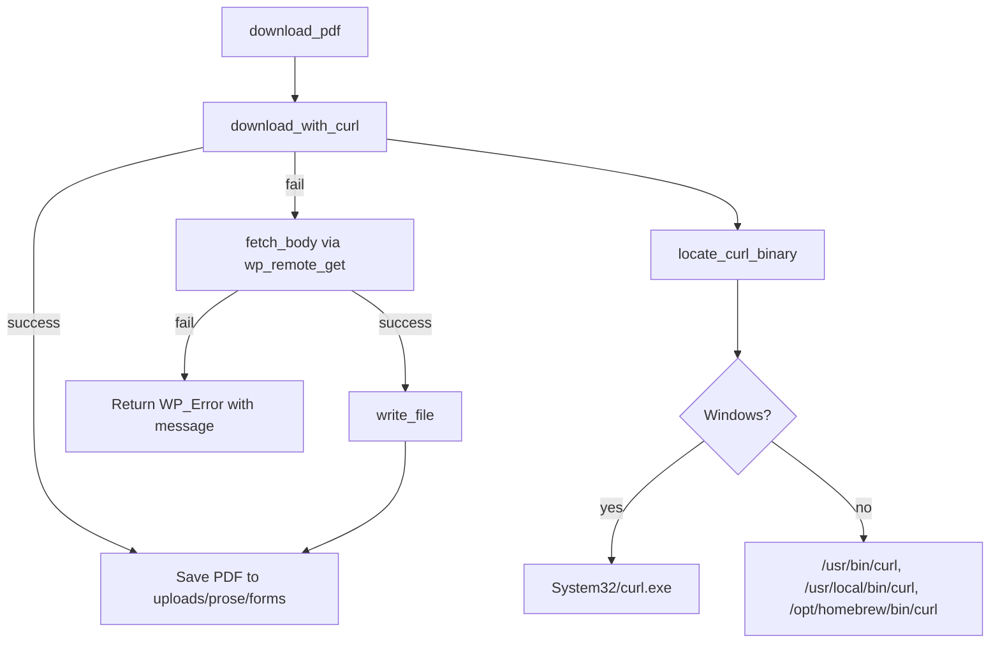

# ProSe Core

ProSe Core is the foundation of the ProSe platform — a modular WordPress plugin for court navigation, forms automation, intake, and workflow management. This release ships the **core architecture** plus the first module, **Forms**.

ProSe Core is **not** a chatbot. It is a procedural, database-driven platform. Workflow logic is deterministic; AI (planned in a later module) only explains, collects information, and assists — it never decides legal workflows.

## Requirements

- WordPress 6.0+
- PHP 8.0+
- `curl` available on the host (built into Windows, Linux, and macOS) for PDF downloads
- `proc_open` enabled (optional — see [How it works (all OSes)](#how-it-works-all-oses))

## Features

- Modular, pluggable architecture (`ProSe\Core` namespace, custom autoloader)
- **Forms module**:
  - `prose_form` custom post type (private, REST-enabled)
  - `prose_case_type` hierarchical taxonomy
  - Form metadata (`prose_form_id`, `prose_file_name`, `prose_file_url`, `prose_source_pdf_url`)
  - CSV importer with a live, batched progress bar
  - Cross-platform PDF downloader (Windows / Linux / macOS)
  - Repository pattern for data access (no scattered `WP_Query`)
- Top-level **ProSe** admin menu with **Forms** and **Import Forms**
- Forms list table shows Form Number, a link to the local PDF, and the source URL

## Directory structure

```
prose-core/
  prose-core.php                # Bootstrap: constants, autoloader, hooks
  uninstall.php                 # Conservative cleanup
  includes/
    class-autoloader.php        # Maps ProSe\Core\* to includes/ and modules/
    class-loader.php            # Action/filter queue (register & run)
    class-plugin.php            # Core bootstrap + module registry
    class-admin.php             # Top-level "prose" menu + assets
    interface-module.php        # Module_Interface (pluggable module contract)
  modules/
    forms/
      class-forms-module.php    # Wires the Forms pieces together
      class-form-cpt.php        # prose_form CPT + admin columns
      class-form-taxonomy.php   # prose_case_type taxonomy
      class-form-meta.php       # register_post_meta fields
      class-form-importer.php   # Import Forms page + batched AJAX import
      class-form-file-manager.php  # PDF storage + cross-platform downloader
      class-form-repository.php # Data access layer
  assets/
    css/admin.css
    js/admin.js
  languages/
    prose-core.pot
```

## Installation

1. Place the `prose-core` folder in `wp-content/plugins/`.
2. Activate **ProSe Core** in **Plugins**.
3. On activation the plugin registers the CPT and taxonomy, flushes rewrite rules, and creates `wp-content/uploads/prose/forms/`.

## Importing forms

1. Go to **ProSe → Import Forms**.
2. Upload a CSV. Recognized headers (either spelling works):
   - **Form Number** or **Extracted Form Number**
   - **Form Title** or **Original Form Title**
   - **Case Type** (comma-separated for multiple terms)
   - **PDF Filenames** (pipe `|` separated)
   - **Resolved PDF URLs** (pipe `|` separated)
3. The importer processes rows in batches over AJAX and shows a progress bar plus a per-row result table (created / updated / failed).

For each row the importer:

1. Creates or updates a form by Form Number.
2. Sets the title.
3. Creates any missing `prose_case_type` terms and assigns them.
4. Downloads the first PDF (preferring `.pdf` entries) into `uploads/prose/forms/`.
5. Saves the metadata. A failed download still imports the row and records the source URL.

## How it works (all OSes)

PDF downloading is cross-platform and lives entirely in
[`modules/forms/class-form-file-manager.php`](modules/forms/class-form-file-manager.php).

Many court servers sit behind Cloudflare, which blocks bot User-Agents such as
`curl/8.0.1` with a **403 Forbidden** while allowing browser-like User-Agents.
PHP's bundled HTTP client can also be rejected, so the downloader tries the
system `curl` binary first (with a browser User-Agent), then falls back to the
WordPress HTTP API.



### 1. Entry point — `download_pdf()`

Same flow on every OS: try the system `curl` binary first, then fall back to the
WordPress HTTP API. Both send a browser User-Agent so Cloudflare returns the PDF
instead of a 403.

### 2. OS detection — `locate_curl_binary()`

| OS | Paths checked | Fallback |
|---|---|---|
| **Windows** | `C:\Windows\System32\curl.exe` | `curl.exe` (PATH) |
| **Linux** | `/usr/bin/curl`, `/usr/local/bin/curl`, `/bin/curl` | `curl` (PATH) |
| **macOS** | same Linux list **plus** `/opt/homebrew/bin/curl` | `curl` (PATH) |

macOS is handled in the non-Windows branch and gets the same Unix paths as
Linux, with one extra entry for Apple Silicon Homebrew:

- `/usr/bin/curl` — built-in macOS curl (always present)
- `/usr/local/bin/curl` — Intel Mac Homebrew
- `/opt/homebrew/bin/curl` — Apple Silicon (M1/M2/M3) Homebrew

On a typical Mac, `/usr/bin/curl` exists, so downloads work without installing
anything extra.

### 3. Curl execution — `download_with_curl()`

Runs `curl -sS -L -f -A <browser UA> --max-time 120 -o <dest> <url>` via
`proc_open()`. Cloudflare blocks `curl/x` User-Agents but accepts browser
User-Agents — identical behavior on Windows, Linux, and macOS. Curl's stderr and
exit code are captured so failures report the real reason.

### 4. PHP fallback — `fetch_body()` + `request()`

If `curl` is unavailable (for example, `proc_open` is disabled on shared
hosting), the plugin uses `wp_remote_get()` with browser headers. Because the
block is User-Agent-based rather than TLS-based, this fallback usually succeeds
on Linux and macOS too. It also retries once with SSL verification disabled if
the host has a broken CA bundle (common in local development).

### Platform support summary

| Scenario | Expected result |
|---|---|
| Local Windows (Laragon / XAMPP / WAMP) | Works via `System32\curl.exe` |
| Local macOS (MAMP / Valet / Docker) | Works via `/usr/bin/curl` |
| Apple Silicon + Homebrew curl | Works via `/opt/homebrew/bin/curl` |
| Production Linux server | Works via `/usr/bin/curl` (most common) |
| `proc_open` disabled | Falls back to `wp_remote_get` (usually works) |
| Both methods blocked | Form still imports with its source URL preserved |

## Filters

| Filter | Purpose |
|---|---|
| `prose_core_modules` | Register additional modules (array of class names). |
| `prose_core_curl_binary` | Force a specific `curl` path (skips auto-detection). |
| `prose_core_download_user_agent` | Override the User-Agent used for downloads. |
| `prose_core_enable_curl_fallback` | Set to `false` to use the PHP HTTP API only. |
| `prose_core_download_sslverify` | Toggle SSL verification (default `true`). |

Examples:

```php
// Force a custom curl path (e.g. a non-standard install).
add_filter( 'prose_core_curl_binary', fn() => '/custom/path/to/curl' );

// Custom User-Agent.
add_filter( 'prose_core_download_user_agent', fn( $ua, $url ) => 'MyAgent/1.0', 10, 2 );

// Disable the curl binary and use the PHP HTTP API only.
add_filter( 'prose_core_enable_curl_fallback', '__return_false' );

// Disable SSL verification (local development only).
add_filter( 'prose_core_download_sslverify', '__return_false' );
```

## Extending: adding a module

The core does not hardcode the Forms module. Implement `Module_Interface` and
register your class via the `prose_core_modules` filter:

```php
use ProSe\Core\Loader;
use ProSe\Core\Module_Interface;

final class Cases_Module implements Module_Interface {
    public function register( Loader $loader ): void {
        // $loader->add_action( ... );
        // $loader->add_filter( ... );
    }
}

add_filter( 'prose_core_modules', function ( array $modules ) {
    $modules[] = Cases_Module::class;
    return $modules;
} );
```

Planned future modules: **Cases**, **Questionnaires**, **Documents**, **AI**,
**Automation**.

## Data access

Use the repository instead of direct `WP_Query` calls:

```php
$repo = ( new ProSe\Core\Forms\Forms_Module() )->get_repository();

$form  = $repo->get_by_form_id( 'UD-1' );
$forms = $repo->get_by_case_type( 'Divorce' );
$repo->create_or_update( array(
    'form_id'    => 'UD-1',
    'title'      => 'Summons With Notice',
    'case_types' => array( 'Divorce' ),
) );
```

## Uninstall

`uninstall.php` is conservative: it removes plugin options only. Form posts,
taxonomy terms, and downloaded PDFs are left intact so data removal is an
explicit, future decision.

## License

GPL-2.0-or-later.
