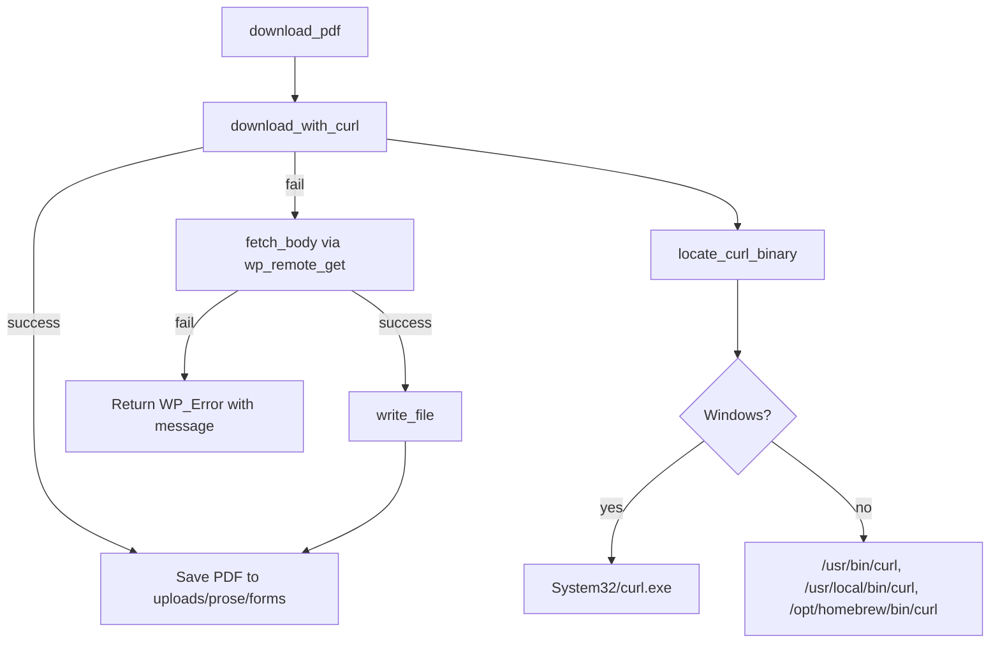

# ProSe Core

ProSe Core is the foundation of the ProSe platform — a modular WordPress plugin for court navigation, forms automation, intake, and workflow management. This release ships the **core architecture** plus the first module, **Forms**.

ProSe Core is **not** a chatbot. It is a procedural, database-driven platform. Workflow logic is deterministic; AI (planned in a later module) only explains, collects information, and assists — it never decides legal workflows.

## Requirements

- WordPress 6.0+
- PHP 8.0+
- `curl` available on the host (built into Windows, Linux, and macOS) for PDF downloads
- `proc_open` enabled (optional — see [How it works (all OSes)](#how-it-works-all-oses))

## Features

- Modular, pluggable architecture (`ProSe\Core` namespace, custom autoloader)
- **Forms module**:
  - `prose_form` custom post type (private, REST-enabled)
  - Taxonomies: `prose_case_type`, `prose_court`, `prose_workflow_stage` (all REST-enabled, filterable)
  - Expanded form metadata for workflow, packet generation, PDF analysis, automation, and AI
  - Tabbed Form Details admin UI with embedded PDF viewer and Workflow Preview
  - CSV importer with a live, batched progress bar
  - Cross-platform PDF downloader (Windows / Linux / macOS)
  - Repository pattern for data access (no scattered `WP_Query`)
  - `Pdf_Analyzer` service stub (extension point for future PDF scanning)
- Top-level **ProSe** admin menu with **Forms** and **Import Forms**
- Forms list table shows Form Code, Court, Case Type, Workflow Stage, Workflow Key, Packet Group, Required, PDF, and PDF Fields

## Directory structure

```
prose-core/
  prose-core.php                # Bootstrap: constants, autoloader, hooks
  uninstall.php                 # Conservative cleanup
  includes/
    class-autoloader.php        # Maps ProSe\Core\* to includes/ and modules/
    class-loader.php            # Action/filter queue (register & run)
    class-plugin.php            # Core bootstrap + module registry
    class-admin.php             # Top-level "prose" menu + assets
    interface-module.php        # Module_Interface (pluggable module contract)
  modules/
    forms/
      class-forms-module.php    # Wires the Forms pieces together
      class-form-cpt.php        # prose_form CPT + admin columns
      class-form-taxonomy.php   # case type, court, workflow stage taxonomies
      class-form-meta.php       # register_post_meta fields
      class-form-admin.php      # tabbed edit screen, PDF viewer, workflow preview
      class-form-importer.php   # Import Forms page + batched AJAX import
      class-form-file-manager.php  # PDF storage + cross-platform downloader
      class-form-repository.php # Data access layer
      class-pdf-analyzer.php    # PDF analysis stub (not yet implemented)
  assets/
    css/admin.css
    js/admin.js
  languages/
    prose-core.pot
```

## Installation

1. Place the `prose-core` folder in `wp-content/plugins/`.
2. Activate **ProSe Core** in **Plugins**.
3. On activation the plugin registers the CPT and taxonomies, seeds default Court and Workflow Stage terms, flushes rewrite rules, and creates `wp-content/uploads/prose/forms/`.

## Form schema

`prose_form` is the central source of truth for court forms, workflow engine, questionnaire mapping, PDF analysis, auto-fill, packet generation, and AI assistance.

### Taxonomies

| Taxonomy | Terms (seeded on activation) |
|---|---|
| `prose_case_type` | User-defined (hierarchical) |
| `prose_court` | Supreme Court, Family Court |
| `prose_workflow_stage` | Divorce → Commencement, Service, Response, Settlement, Judgment, Post-Judgment; Family Court → Petition, Hearing, Order, Enforcement, Modification |

### Meta fields

| Group | Keys |
|---|---|
| **Core** | `prose_form_code`, `prose_county`, `prose_workflow_key`, `prose_workflow_order`, `prose_packet_group`, `prose_required`, `prose_dependencies`, `prose_conditions` |
| **PDF storage** | `prose_file_name`, `prose_file_url`, `prose_source_pdf_url` |
| **PDF analysis** | `prose_pdf_fillable`, `prose_pdf_field_count`, `prose_pdf_fields_json`, `prose_pdf_analyzed_at` |
| **Automation** | `prose_fillable_fields`, `prose_field_mapping_json` |
| **AI** | `prose_ai_summary`, `prose_plain_language_description`, `prose_common_mistakes` |

`prose_form_code` is canonical; it is mirrored to legacy `prose_form_id` for backward compatibility.

## Importing forms

1. Go to **ProSe → Import Forms**.
2. Upload a CSV. Recognized headers (either spelling works):
   - **Form Number** or **Extracted Form Number**
   - **Form Title** or **Original Form Title**
   - **Case Type** (comma-separated for multiple terms)
   - **Court** (optional, comma-separated)
   - **PDF Filenames** (pipe `|` separated)
   - **Resolved PDF URLs** (pipe `|` separated)
3. The importer processes rows in batches over AJAX and shows a progress bar plus a per-row result table (created / updated / failed).

For each row the importer:

1. Creates or updates a form by Form Code.
2. Sets the title.
3. Creates any missing `prose_case_type` and `prose_court` terms and assigns them.
4. Downloads the first PDF (preferring `.pdf` entries) into `uploads/prose/forms/`.
5. Saves Form Code, Court, Case Type, Source PDF URL, File Name, and File URL. PDF analysis fields are left empty.

## How it works (all OSes)

PDF downloading is cross-platform and lives entirely in
[`modules/forms/class-form-file-manager.php`](modules/forms/class-form-file-manager.php).

Many court servers (e.g. `webfiles.nycourts.gov`, `www.nycourts.gov/media`) sit
behind **Cloudflare Bot Management**, which blocks clients by their **TLS
fingerprint (JA3/JA4)** — *not* by User-Agent. A browser User-Agent alone still
returns **403 Forbidden** when the underlying TLS handshake comes from OpenSSL
(PHP's HTTP client and stock Linux `curl`).

The downloader tries the system `curl` binary first, then falls back to the
WordPress HTTP API. This is enough on **Windows** (the bundled `System32\curl.exe`
uses the *Schannel* TLS stack, whose fingerprint Cloudflare accepts) but **not on
a Linux server**, where curl uses OpenSSL and Cloudflare returns 403.

> **Linux servers behind Cloudflare:** install
> [`curl-impersonate`](https://github.com/lwthiker/curl-impersonate) so the
> downloader can present a real browser TLS fingerprint. See
> [Cloudflare-protected servers](#cloudflare-protected-servers-linux) below.
> The plugin auto-detects `curl_chrome*` / `curl_ff*` wrapper scripts in
> `/usr/local/bin`, `/usr/bin`, and `/opt/curl-impersonate`, and uses them
> automatically (no User-Agent override is applied to them).



### 1. Entry point — `download_pdf()`

Same flow on every OS: try the system `curl` binary first, then fall back to the
WordPress HTTP API. Both send a browser User-Agent so Cloudflare returns the PDF
instead of a 403.

### 2. OS detection — `locate_curl_binary()`

| OS | Paths checked | Fallback |
|---|---|---|
| **Windows** | `C:\Windows\System32\curl.exe` | `curl.exe` (PATH) |
| **Linux** | `/usr/bin/curl`, `/usr/local/bin/curl`, `/bin/curl` | `curl` (PATH) |
| **macOS** | same Linux list **plus** `/opt/homebrew/bin/curl` | `curl` (PATH) |

macOS is handled in the non-Windows branch and gets the same Unix paths as
Linux, with one extra entry for Apple Silicon Homebrew:

- `/usr/bin/curl` — built-in macOS curl (always present)
- `/usr/local/bin/curl` — Intel Mac Homebrew
- `/opt/homebrew/bin/curl` — Apple Silicon (M1/M2/M3) Homebrew

On a typical Mac, `/usr/bin/curl` exists, so downloads work without installing
anything extra.

### 3. Curl execution — `download_with_curl()`

Runs `curl -sS -L -f -A <browser UA> --max-time 120 -o <dest> <url>` via
`proc_open()`. Cloudflare blocks `curl/x` User-Agents but accepts browser
User-Agents — identical behavior on Windows, Linux, and macOS. Curl's stderr and
exit code are captured so failures report the real reason.

### 4. PHP fallback — `fetch_body()` + `request()`

If `curl` is unavailable (for example, `proc_open` is disabled on shared
hosting), the plugin uses `wp_remote_get()` with browser headers. It also retries
once with SSL verification disabled if the host has a broken CA bundle (common in
local development). Note: against a **Cloudflare TLS-fingerprint** block, this PHP
fallback also returns 403 — only `curl-impersonate` reliably succeeds on Linux.

## Cloudflare-protected servers (Linux)

On a Linux server (OpenLiteSpeed / Nginx / Apache on DigitalOcean, etc.) stock
`curl` and PHP both use OpenSSL, whose TLS fingerprint Cloudflare blocks with a
403. Install [`curl-impersonate`](https://github.com/lwthiker/curl-impersonate)
once and the importer will use it automatically.

**1. Install the static Chrome build (Ubuntu / Debian, x86_64):**

```bash
cd /tmp
VER=0.6.1
curl -L -O "https://github.com/lwthiker/curl-impersonate/releases/download/v${VER}/curl-impersonate-v${VER}.x86_64-linux-gnu.tar.gz"
sudo mkdir -p /opt/curl-impersonate
sudo tar -xzf "curl-impersonate-v${VER}.x86_64-linux-gnu.tar.gz" -C /opt/curl-impersonate
# Make the wrapper scripts available on PATH (they self-resolve the binary dir).
sudo ln -sf /opt/curl-impersonate/curl_chrome116 /usr/local/bin/curl_chrome116
```

**2. Verify it bypasses Cloudflare (should print `200`):**

```bash
/usr/local/bin/curl_chrome116 -sS -L -o /dev/null -w '%{http_code}\n' \
  "https://webfiles.nycourts.gov/public/2025-12/doh-2168.pdf"
```

**3. (Optional) Pin the exact binary** with a small mu-plugin
(`wp-content/mu-plugins/prose-curl-impersonate.php`) if auto-detection misses it:

```php
<?php
add_filter( 'prose_core_curl_binary', static fn() => '/usr/local/bin/curl_chrome116' );
```

### OpenLiteSpeed notes

- The PDF download runs through `proc_open()`. Make sure `proc_open`,
  `proc_close`, and `escapeshellarg` are **not** listed in `disable_functions`
  in the active LSPHP `php.ini` (the importer reports which function is disabled
  if so). Restart LiteSpeed after editing: `sudo systemctl restart lsws`.
- If `open_basedir` is set for the vhost, add `/opt/curl-impersonate` (or
  wherever the wrapper lives) to it so PHP can execute the binary.

### Platform support summary

| Scenario | Expected result |
|---|---|
| Local Windows (Laragon / XAMPP / WAMP) | Works via `System32\curl.exe` (Schannel fingerprint accepted) |
| Local macOS (MAMP / Valet / Docker) | **403 from Cloudflare** unless `curl-impersonate` is installed |
| Production Linux server (Cloudflare-protected source) | Requires `curl-impersonate` — stock `curl`/PHP get 403 |
| Production Linux server (non-Cloudflare source) | Works via `/usr/bin/curl` |
| `proc_open` disabled | Falls back to `wp_remote_get` (still 403 against Cloudflare TLS block) |
| Both methods blocked | Form still imports with its source URL preserved |

## Filters

| Filter | Purpose |
|---|---|
| `prose_core_modules` | Register additional modules (array of class names). |
| `prose_core_curl_binary` | Force a specific `curl` path (skips auto-detection). |
| `prose_core_download_user_agent` | Override the User-Agent used for downloads. |
| `prose_core_enable_curl_fallback` | Set to `false` to use the PHP HTTP API only. |
| `prose_core_download_sslverify` | Toggle SSL verification (default `true`). |

Examples:

```php
// Force a custom curl path (e.g. a non-standard install).
add_filter( 'prose_core_curl_binary', fn() => '/custom/path/to/curl' );

// Custom User-Agent.
add_filter( 'prose_core_download_user_agent', fn( $ua, $url ) => 'MyAgent/1.0', 10, 2 );

// Disable the curl binary and use the PHP HTTP API only.
add_filter( 'prose_core_enable_curl_fallback', '__return_false' );

// Disable SSL verification (local development only).
add_filter( 'prose_core_download_sslverify', '__return_false' );
```

## Extending: adding a module

The core does not hardcode the Forms module. Implement `Module_Interface` and
register your class via the `prose_core_modules` filter:

```php
use ProSe\Core\Loader;
use ProSe\Core\Module_Interface;

final class Cases_Module implements Module_Interface {
    public function register( Loader $loader ): void {
        // $loader->add_action( ... );
        // $loader->add_filter( ... );
    }
}

add_filter( 'prose_core_modules', function ( array $modules ) {
    $modules[] = Cases_Module::class;
    return $modules;
} );
```

Planned future modules: **Cases**, **Questionnaires**, **Documents**, **AI**,
**Automation**.

## Data access

Use the repository instead of direct `WP_Query` calls:

```php
$repo = ( new ProSe\Core\Forms\Forms_Module() )->get_repository();

$form  = $repo->get_by_form_code( 'UD-1' );
$forms = $repo->get_by_case_type( 'Divorce' );
$forms = $repo->get_forms_by_workflow( 'uncontested_divorce' );
$forms = $repo->get_forms_by_stage( 'Commencement' );
$forms = $repo->get_packet_forms( 'uncontested_divorce', 'Initial Filing' );
$forms = $repo->get_forms_missing_analysis();
$repo->create_or_update( array(
    'form_code'      => 'UD-1',
    'title'          => 'Summons With Notice',
    'case_types'     => array( 'Divorce' ),
    'court'          => array( 'Supreme Court' ),
    'workflow_key'   => 'uncontested_divorce',
    'workflow_order' => 10,
    'packet_group'   => 'Initial Filing',
    'required'       => true,
) );
$repo->update_pdf_metadata( $post_id, array(
    'fillable'     => true,
    'field_count'  => 42,
    'fields_json'  => array(),
    'analyzed_at'  => gmdate( 'c' ),
) );
```

## PDF Analyzer (extension point)

`ProSe\Core\Forms\Pdf_Analyzer` is a service stub for the future PDF Analysis Engine. All methods throw `Not_Implemented_Exception`:

- `analyze( int $post_id )` — analyze a form's PDF and persist metadata
- `extract_fields( string $file_path )` — extract raw fields from a PDF
- `normalize_fields( array $fields )` — normalize into ProSe schema
- `save_metadata( int $post_id, array $data )` — save analysis results

Do not call these in production until the engine is implemented.

## Uninstall

`uninstall.php` is conservative: it removes plugin options only. Form posts,
taxonomy terms, and downloaded PDFs are left intact so data removal is an
explicit, future decision.

## License

GPL-2.0-or-later.
