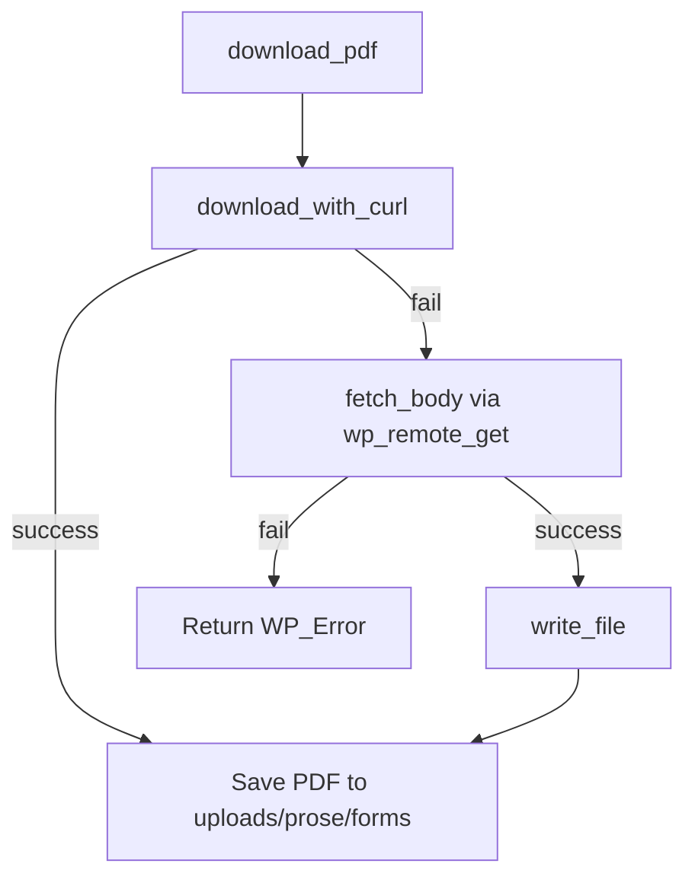

# ProSe Core

ProSe Core is the WordPress plugin behind **CourtFlow AI** — a procedural workflow platform for NYC family and matrimonial matters. It is **not** a chatbot: deterministic rules choose court, workflow, required forms, and next steps; AI only explains, collects information, summarizes, and assists.

Companion theme: **`prose-app`** (`public/wp-content/themes/prose-app`) — homepage intake chat, CourtFlow workspace, auth pages, and user dashboard.

See also the repo root [`AGENTS.md`](../../../../AGENTS.md) for architecture principles agents should follow.

## Requirements

- WordPress 6.0+
- PHP 8.0+
- `curl` on the host (for PDF downloads)
- `proc_open` optional — see [How it works (all OSes)](#how-it-works-all-oses)
- Node.js (theme only) — to rebuild Tailwind assets in `prose-app`

## Platform overview

| Layer | Role |
|-------|------|
| **Routing engine** | Resolves workflow from facts; never hardcoded in UI or AI |
| **Intake / CourtFlow** | Session state, case profile, workspace REST, stage progression |
| **AI intake** | Conversational fact extraction + replies; English-only guard; filing guidance briefs |
| **Stage form presenter** | Stage-gated form disclosure — only current-stage forms are visible |
| **Package builder** | Blank/filled manifests, previews, merged PDFs, ZIP output |
| **Guidance engine** | Curated stage steps, county notes, filing brief JSON |
| **Procedural navigator** | Court + workflow + next-step scaffolding for intake |
| **Packet builder** | Merge court PDFs into downloadable packets |
| **Forms module** | `prose_form` CPT, JSON catalog, import, classification, PDF analysis |
| **Users module** | Client role, login/register/dashboard pages, conversation persistence |

### Core rule

**AI never determines legal workflows.** The rules engine and workflow JSON repositories decide court, workflow, required forms, and next steps.

## Modules

Registered in `includes/class-plugin.php` (extend via `prose_core_modules` filter):

| Module | Path | Purpose |
|--------|------|---------|
| Forms | `modules/forms/` | CPT, taxonomies, import, JSON catalog, PDF analysis |
| Intake | `modules/intake/` | CourtFlow sessions, case actions, response mapper |
| Package Builder | `modules/packagebuilder/` | Manifests, previews, blank PDF merge |
| Assembly | `modules/assembly/` | Document assembly pipeline |
| Procedural | `modules/procedural/` | Navigator + REST |
| Packet | `modules/packet/` | PDF packet merge + cache |
| Guidance | `modules/guidance/` | Stage guidance JSON, filing briefs |
| Documents | `modules/documents/` | Document classification REST |
| AI Intake | `modules/ai-intake/` | `POST /prose/v1/intake/interpret`, language guard |
| Search | `modules/search/` | Form/workflow search REST |
| Security | `modules/security/` | Security hooks |
| Users | `modules/users/` | Auth gate, dashboard API, session claim |

Workflow definitions live under `docs/workflows/` (JSON). Runtime forms catalog: `docs/forms/*.json` — see [docs/forms/README.md](docs/forms/README.md).

## Directory structure

```
prose-core/
  prose-core.php
  includes/                 # Autoloader, plugin bootstrap, admin shell
  modules/
    forms/                  # CPT, import, classification, JSON sync
    routing/                # Workflow catalog, routing engine, fact store
    intake/                 # CourtFlow sessions, chat assets, REST
    ai-intake/              # Conversational interpreter + REST
    packagebuilder/         # Manifest builder, preview shortcode
    guidance/               # Stage JSON, county data, filing briefs
    procedural/             # Procedural navigator
    packet/                 # PDF merge + store
    assembly/ documents/ search/ security/ users/
  docs/
    forms/                  # Runtime forms JSON catalog
    workflows/              # Workflow JSON definitions
  tests/                    # PHPUnit bootstrap + unit tests
  bin/                      # CLI helpers, run-tests.ps1
```

## Installation

1. Place `prose-core` in `wp-content/plugins/` and activate **ProSe Core**.
2. Activate the **Prose App** theme (`prose-app`).
3. On activation the plugin registers CPTs/taxonomies, seeds guidance + CourtFlow data, runs DB migrations, creates auth/dashboard pages, and flushes rewrite rules.
4. Build theme CSS (from `prose-app`):

```bash
npm install
npm run build
```

## Frontend (prose-app theme)

| Page / area | Template | Notes |
|-------------|----------|-------|
| Homepage | `front-page.php` | 1200px intake chat column at 1440px desktop; `[prose_intake_chat]` |
| CourtFlow workspace | CourtFlow templates | Stage-gated forms, context panel, Get Documents |
| Login / Register | `page-login.php`, `page-register.php` | Custom auth forms |
| Dashboard | `page-dashboard.php` | Saved conversations, resume links (`build/dashboard.js`) |
| Forgot / Reset password | `page-forgot-password.php`, `page-reset-password.php` | |

Intake chat calls `POST /prose/v1/intake/interpret`. Logged-in users persist turns to `prose_conversations` / `prose_messages` (see schema in `docs/plans/schema/case-persistence.sql`).

## REST API (selected)

Namespace: `prose/v1`

| Route | Module | Purpose |
|-------|--------|---------|
| `POST /intake/interpret` | AI Intake | Conversational intake turn |
| `GET/POST /courtflow/sessions/...` | Intake | Workspace session CRUD, messages, stage complete |
| `GET /guidance/{workflow}` | Guidance | Stage guidance for a workflow |
| `POST /packages/preview` | Package Builder | Stage-scoped blank package preview |
| `POST /packets/...` | Packet | Build/download merged PDF packets |
| `GET /me/dashboard` | Users | Dashboard payload (conversations, cases) |
| `GET /me/conversations/session/{id}` | Users | Resume conversation for chat |

Auth-gated actions (persist case, generate/download PDF) return `401` with login/register URLs when the user is not logged in.

## Intake behavior (summary)

- **Routing first** — divorce routing keys (`spouse_agrees`, `children`, `marital_property_resolved`, etc.) resolve the workflow before personal fields block downloads.
- **Stage-gated forms** — once workflow is resolved, `forms_visible` is true for the **current stage only** (commencement forms first). Filter: `prose_stage_gated_forms`.
- **Filing guidance brief** — deterministic JSON brief delivered when forms unlock; sets `next_action: guidance`.
- **English only** — non-English messages (e.g. Vietnamese) receive a bilingual restriction reply without processing intake.
- **Get Documents** — enabled when workflow is resolved and current-stage forms are visible.

## Forms: JSON catalog + prose_form

CourtFlow uses a **split model**:

| Layer | Role |
|-------|------|
| **`docs/forms/*.json`** (`Forms_Catalog`) | Runtime source of truth — workflow refs, `generation_ready`, asset paths |
| **`prose_form` CPT** | WordPress admin — CSV import, downloads, PDF analysis, classification |

When you import or save a form, **`Form_Asset_Sync`** copies asset metadata into the matching JSON file. Runtime code does **not** read PDF paths from `prose_form` directly.

Bulk backfill:

```bash
wp prose forms build-repository
```

### Taxonomies (seeded on activation)

| Taxonomy | Examples |
|----------|----------|
| `prose_case_type` | Divorce variants, custody, visitation, order of protection, … |
| `prose_court` | Supreme Court, Family Court |
| `prose_workflow_stage` | Commencement, Service, Calendar, Judgment, … |

### Meta fields (high level)

| Group | Keys |
|-------|------|
| **Core** | `prose_form_code`, `prose_workflow_key`, `prose_packet_group`, `prose_required`, … |
| **PDF storage** | `prose_source_files`, `prose_file_url`, … |
| **Classification** | `prose_detected_court`, `prose_detected_case_type`, `prose_classification_confidence`, … |
| **Automation / AI** | `prose_fillable_fields`, `prose_ai_summary`, … |

Full field list and import flow are unchanged from earlier releases — see sections below.

## Importing forms

1. Go to **ProSe → Import Forms**.
2. Upload CSV with columns: Form Number, Form Title, Case Type, Court, PDF Filenames, Resolved PDF URLs.
3. Batched AJAX import downloads court files, runs classification, syncs JSON catalog.

See [docs/form-import-multi-file.md](docs/form-import-multi-file.md) for storage layout and duplicate rules.

## Form Intelligence Engine

On import or reclassify:

1. Extract text + AcroForm fields (hybrid PHP / optional Python sidecar)
2. Classify court, county, case type, workflow stage
3. Normalize fields, dependencies, workflow package metadata
4. Persist when confidence ≥ 70

**Authority:** PDF content > filename > CSV > AI inference.

Optional Python deps:

```bash
pip install pdfplumber pymupdf pypdf
python3 wp-content/plugins/prose-core/bin/prose-pdf.py --check
```

### Filters (forms / PDF)

| Filter | Purpose |
|--------|---------|
| `prose_core_auto_classify_on_import` | Auto-classify on CSV import (default `true`) |
| `prose_core_pdf_engine` | Force `php` or `python` |
| `prose_core_curl_binary` | Force curl path (Cloudflare bypass) |
| `prose_stage_gated_forms` | Toggle stage-gated form UI (default `true`) |
| `prose_core_modules` | Register additional modules |

## How it works (all OSes)

PDF downloading is cross-platform in [`modules/forms/class-form-file-manager.php`](modules/forms/class-form-file-manager.php).

Many NY court servers sit behind **Cloudflare Bot Management** (TLS fingerprint, not User-Agent). Windows `System32\curl.exe` (Schannel) usually works locally; **Linux production** often needs [`curl-impersonate`](https://github.com/lwthiker/curl-impersonate).



### Cloudflare-protected servers (Linux)

```bash
cd /tmp
VER=0.6.1
curl -L -O "https://github.com/lwthiker/curl-impersonate/releases/download/v${VER}/curl-impersonate-v${VER}.x86_64-linux-gnu.tar.gz"
sudo mkdir -p /opt/curl-impersonate
sudo tar -xzf "curl-impersonate-v${VER}.x86_64-linux-gnu.tar.gz" -C /opt/curl-impersonate
sudo ln -sf /opt/curl-impersonate/curl_chrome116 /usr/local/bin/curl_chrome116
```

Optional mu-plugin:

```php
add_filter( 'prose_core_curl_binary', static fn() => '/usr/local/bin/curl_chrome116' );
```

| Scenario | Expected result |
|----------|-----------------|
| Local Windows | Works via `System32\curl.exe` |
| Local macOS / Linux + Cloudflare | Install `curl-impersonate` |
| `proc_open` disabled | Falls back to `wp_remote_get` (often 403 on Cloudflare) |

## Data access examples

**Runtime catalog:**

```php
$catalog = new \ProSe\Core\Forms\Forms_Catalog();
$form    = $catalog->by_code( 'UD-1' );
$records = $catalog->get_form_records_for_workflow( 'uncontested_divorce_children_nyc' );
```

**Stage context (current-stage forms only):**

```php
$presenter = new \ProSe\Core\Forms\Engine\Stage_Form_Presenter();
$context   = $presenter->present( array(
    'workflow'        => 'uncontested_divorce_no_children_nyc',
    'facts'           => array( 'spouse_agrees' => true, 'children' => false ),
    'intake_complete' => false,
) );
// $context['forms_visible'], $context['stage_forms'], $context['current_stage']
```

**Workflow routing:**

```php
$engine = new \ProSe\Core\Routing\Routing_Engine();
$result = $engine->route( array( 'issue' => 'divorce', 'facts' => $facts ) );
```

## Extending: adding a module

Implement `Module_Interface` and register via `prose_core_modules`:

```php
add_filter( 'prose_core_modules', function ( array $modules ) {
    $modules[] = My_Module::class;
    return $modules;
} );
```

## Tests

PHPUnit runs **outside WordPress** with stubs in `tests/bootstrap.php`.

```bash
cd public/wp-content/plugins/prose-core
composer install
composer test
```

Windows PowerShell:

```powershell
.\bin\run-tests.ps1
.\bin\run-tests.ps1 -Suite intake
```

Temp directories use `tests/tmp/` via `prose_test_temp_dir()` — avoids `C:\Windows\TEMP` permission errors on Windows.

Full details: [tests/README.md](tests/README.md).

## Uninstall

`uninstall.php` removes plugin options only. Form posts, taxonomy terms, downloaded PDFs, and custom tables are left intact.

## License

GPL-2.0-or-later.
