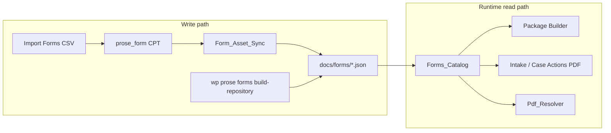

# CourtFlow AI Forms Repository

The Forms Repository (`docs/forms/`) is the **runtime source of truth** for CourtFlow AI. Given a workflow, it answers:

- Which forms are required?
- Which files exist?
- Which file version should be used?
- Which source format should be preferred?
- Where are the files stored?

The WordPress `prose_form` post type is the **asset workspace** — imports, uploads, PDF analysis, and classification. It does **not** drive runtime package building or chat PDF downloads directly.

## prose_form vs JSON catalog

| Concern | Owner | Examples |
|---------|--------|----------|
| **Procedural metadata** | JSON (`docs/forms/*.json`) | `form_code`, `title`, `court`, `workflow_references`, `fillable_strategy`, `field_mapping_status` |
| **Binary assets** | `prose_form` post meta + uploads | `prose_source_files`, `prose_file_url`, `prose_pdf_fillable` |
| **Derived readiness** | JSON (computed on sync) | `source_files`, `preferred_source`, `generation_ready`, `import_status` |



**Rules:**

1. **Runtime code reads only `Forms_Catalog`** (JSON). `Pdf_Resolver`, package preview, and chat downloads do not fall back to `prose_form` posts.
2. **`Form_Asset_Sync`** copies asset slots from a `prose_form` post into the matching JSON record and recomputes `generation_ready`.
3. **Procedural fields are not overwritten from WordPress** during asset sync (workflow refs, court, title stay in JSON unless you edit JSON or run a full repository build).
4. **`wp prose forms build-repository`** remains the bulk backfill: CSV + workflow stubs + optional enrichment from all `prose_form` posts.

### When sync runs automatically

| Trigger | Class / hook |
|---------|----------------|
| Save a form in **ProSe → Forms** | `save_post_prose_form` → `Form_Asset_Sync` |
| Each successful **Import Forms** row | `Form_Importer` after classification |
| Manual / bulk backfill | `wp prose forms build-repository` |

### Sync filters

| Filter | Default | Purpose |
|--------|---------|---------|
| `prose_core_sync_form_assets_on_save` | `true` | Sync JSON when a `prose_form` post is saved |
| `prose_core_sync_form_assets_on_import` | `true` | Sync JSON after each imported row |
| `prose_core_form_assets_synced` | — | Action: `( $form_code, $post_id, $record )` after a successful write |

Disable sync during bulk migrations:

```php
add_filter( 'prose_core_sync_form_assets_on_save', '__return_false' );
```

## Procedural chain

```
Workflow → Forms Repository (JSON) → Canonical Form Assets → Package Builder / Chat download
```

The Workflow Repository (`docs/workflows/`) remains the procedural source of truth for **which** forms belong to a matter. Forms attach to workflows via `workflow_references` on each canonical JSON record.

## Consumers

This repository is the foundation for:

- **Package Builder** — stage-based document packages and chat preview
- **Intake / Case Actions** — merged blank PDF download via `Pdf_Resolver` → `Forms_Catalog`
- **Form Filling Engine** — `fillable_strategy`, `generation_ready`
- **Procedural Navigator** — workflow-to-form relationships
- **Admin QA Tools** — `field_mapping_status`, coverage reports
- **Court Routing Engine** — reads workflow form codes; repository validates they exist

## Structure

```
docs/forms/
  README.md
  schema/form.schema.json
  supreme_court/          # divorce / matrimonial forms (UD-*, DRL-*, etc.)
  family_court/           # custody, visitation, child support, paternity, etc.
  manifest.json           # generated
  workflow_coverage.md    # generated
```

## Source file priority

Official court files may include multiple formats for the same form. The repository prefers:

1. **DOCX** — preferred editable source
2. **WPD converted to DOCX** — `converted_docx` slot
3. **Fillable PDF** — AcroForm fields
4. **Static PDF** — overlay rendering fallback

These drive `preferred_source`, `editable_source`, and `fillable_strategy`.

## Key schema fields

| Field | Purpose |
|-------|---------|
| `form_code` | Official OCA form code (canonical key) |
| `source_files` | All downloaded assets by slot (`pdf`, `fillable_pdf`, `docx`, `wpd`, etc.) |
| `preferred_source` | Highest-priority available slot |
| `editable_source` | Source type for editing/generation |
| `wpd_conversion` | `original_wpd` + `converted_docx` (original WPD never deleted) |
| `workflow_references` | Reverse index: which workflows/stages require this form |
| `fillable_strategy` | `docx_template`, `pdf_acroform`, `pdf_overlay`, or `none` |
| `field_mapping_status` | QA state: `unmapped`, `partial`, `mapped`, `not_required` |
| `generation_ready` | `true` when a usable source asset exists on disk |

## Build the repository

Generate or refresh canonical JSON records from `forms_enriched.csv`, existing `prose_form` posts (when WordPress is available), and workflow-referenced form stubs.

Use **build-repository** for initial seeding, bulk backfill, or when many forms need asset slots copied from WordPress at once. Day-to-day imports and post saves use **automatic asset sync** instead.

```bash
# Standalone (no WP-CLI required)
php app/public/wp-content/plugins/prose-core/bin/build-forms-repository.php

# WP-CLI (enriches asset + optional metadata from prose_form when database is available)
wp prose forms build-repository
wp prose forms build-repository --dry-run
wp prose forms build-repository --convert-wpd
wp prose forms build-repository --csv=/path/to/forms_enriched.csv
```

The generator:

- Reads the full catalog from CSV
- Seeds stub records for workflow-referenced forms missing from CSV (e.g. UD-* divorce forms)
- Merges **asset slots** from `prose_form` (`prose_source_files`, legacy file URL/name, PDF fillable flag)
- Optionally merges aliases and official URL from posts (build command only — not runtime sync)
- Auto-builds `workflow_references` from the Workflow Repository
- Computes `preferred_source`, `editable_source`, `fillable_strategy`, `generation_ready`
- Preserves `field_mapping_status` on regeneration (manual QA progress is not clobbered)

After changing files in WordPress, confirm the JSON record shows `generation_ready: true` and readable `source_files.*.path` values before expecting chat **Get Documents** to work.

## Validate

```bash
php app/public/wp-content/plugins/prose-core/bin/validate-forms.php
```

Validation checks:

1. Every workflow-required form exists in the repository
2. Every form has required metadata
3. `preferred_source` points to a valid `source_files` slot
4. Declared `source_files` paths exist on disk
5. Manifest counts are accurate

Outputs:

- `manifest.json` — aggregate counts
- `workflow_coverage.md` — per-workflow form and asset status

Validation **fails** if any workflow references a missing form.

## Runtime API

`Forms_Catalog` is the **only** runtime read path for package builder, PDF resolver, and intake chat preview/download.

```php
$catalog = new \ProSe\Core\Forms\Forms_Catalog();

// All forms
$all = $catalog->all();

// Single form
$form = $catalog->by_code( 'UD-1' );

// Forms required by a workflow (Package Builder prep)
$codes = $catalog->get_forms_for_workflow( 'custody_nyc' );

// Full records for a workflow
$records = $catalog->get_form_records_for_workflow( 'custody_nyc' );

// Coverage gaps
$missing = $catalog->validate_workflow_coverage();
```

Push assets from WordPress into JSON after import or admin edits:

```php
$sync = new \ProSe\Core\Forms\Form_Asset_Sync();
$result = $sync->sync_post( $post_id ); // or sync_form_code( 'UD-1' )
```

`Forms_Catalog::reset_cache()` is called automatically after each sync write. Call it manually if you edit JSON files on disk outside WordPress.

### Related classes

| Class | Role |
|-------|------|
| `Forms_Catalog` | Read JSON catalog |
| `Form_Asset_Sync` | Write asset fields from `prose_form` → JSON |
| `Form_Record_Enricher` | Shared slot merge + `generation_ready` computation |
| `Form_Record_Paths` | Resolve `docs/forms/{court}/{form}.json` paths |
| `Pdf_Resolver` | Resolve blank PDF path from catalog `source_files` only |

## Phase status

**Forms Repository:** JSON catalog, generator, validator, asset sync, and runtime consumers (package builder, chat blank PDF) are implemented. **Filled** PDF generation from intake facts is not wired to chat yet.
